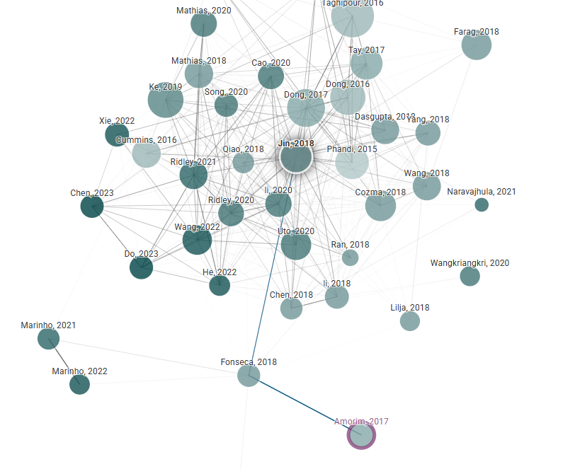

# Sistema de Correção Automática de Redações

Sistema de PLN para correção automática de redações do ENEM, implementando as 5 competências de avaliação com feedback.

## Autor

[Rodrigo Watanabe Pisaia](rodrigo.watanabe0107@gmail.com)

## Contexto do Projeto

Este projeto foi desenvolvido como com o objetivo de criar uma solução completa para correção automática de redações do ENEM, contemplando:

1. **Detecção de desvios no texto**
2. **Atribuição de notas** por competência (0-200) e nota total (0-1000)
3. **Geração de feedback** automático para o aluno

## Competências Avaliadas

| Competência | Descrição | Critérios |
|------------|-----------|-----------|
| Língua Portuguesa | Domínio da norma culta | Gramática, ortografia, pontuação |
| Tema e Gênero | Adequação ao tema dissertativo-argumentativo | Estrutura, desenvolvimento |
| Coerência | Organização lógica das ideias | Progressão textual, argumentação |
| Coesão | Uso adequado de mecanismos linguísticos | Conectivos, referenciação |
| Proposta de Intervenção | Solução para o problema apresentado | Viabilidade, inovação |

## Solução Proposta

### Arquitetura do Sistema

# Artigos e abordagens inspiradas

| Papper       | Autor       | Doi       |
|----------------|----------------|----------------|
| [A Multi-aspect Analysis of Automatic Essay Scoring for Brazilian Portuguese](https://www.semanticscholar.org/paper/A-Multi-aspect-Analysis-of-Automatic-Essay-Scoring-Amorim-Veloso/fb619c5a074393efbaa865f24631598350cf1fef)    | Evelin Amorim, Adriano Veloso    | 10.18653/V1/E17-4010    |
| [TDNN: A Two-stage Deep Neural Network for Prompt-independent Automated Essay Scoring](https://www.semanticscholar.org/paper/TDNN%3A-A-Two-stage-Deep-Neural-Network-for-Automated-Jin-He/440263ac821f0fc448d2cd0ad218623da81adee9)    | Cancan Jin, Ben He, Kai Hui, Le Sun    | 10.18653/v1/P18-1100    |

| [Graph Attention Networks](https://arxiv.org/abs/1710.10903)    | Petar Veličković, Guillem Cucurull, Arantxa Casanova, Adriana Romero, Pietro Liò, Yoshua Bengio    | 10.48550    |

